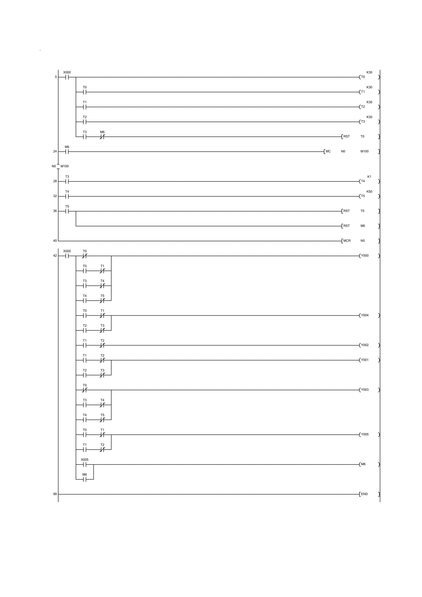

# Feux de Carrefour avec Passage Piéton — Ladder / API Mitsubishi FX

Projet de TP réalisé dans le cadre du cours **EE452 — Automatisme Industriel**  
IGEE, Université M'Hamed Bougara de Boumerdes (2024/2025).  
Environnement : **GX Works 2**, API **Mitsubishi FX**, Mini-PLC Trainer.

---

## Description

Conception et implémentation d'un programme Ladder pour le contrôle automatique
d'un carrefour à feux avec passage piéton. Le système gère deux axes de circulation
(Est/Ouest et Nord/Sud) avec séquences temporisées, et intègre une interruption
piéton via les instructions **MC/MCR** (Master Control / Master Control Reset).

---

## Tableau des Entrées / Sorties

| Référence | Type | Description |
|---|---|---|
| X000 | Entrée | Interrupteur ON/OFF du système |
| X005 | Entrée | Bouton passage piéton |
| Y000 | Sortie | Rouge 1 (Est/Ouest) + Vert piéton |
| Y001 | Sortie | Rouge 2 (Nord/Sud) |
| Y002 | Sortie | Vert 1 (Est/Ouest) + Rouge piéton |
| Y003 | Sortie | Vert 2 (Nord/Sud) |
| Y004 | Sortie | Amber 1 & 2 + Rouge piéton |
| Y005 | Sortie | Attente piéton (RED WAIT) |

---

## Séquence Automatique des Feux

| Étape | Durée | Rouge E/O | Amber E/O | Vert E/O | Rouge N/S | Amber N/S | Vert N/S |
|---|---|---|---|---|---|---|---|
| 1 | 3 sec | ✅ | | | ✅ | | ✅ |
| 2 | 3 sec | ✅ | ✅ | | ✅ | ✅ | |
| 3 | 3 sec | ✅ | | ✅ | ✅ | | |
| 4 | 3 sec | ✅ | ✅ | | ✅ | | |

Cycle continu géré par les timers **T0 → T1 → T2 → T3** (K30 = 3 secondes chacun).

---

## Gestion du Passage Piéton — MC/MCR

Lorsque le bouton piéton (X005) est pressé, le relais **M6** est activé via
un circuit d'auto-maintien. Cela déclenche l'instruction **MC N0 M100**
qui isole un bloc logique indépendant du cycle principal :

1. **T4 (K1 = 0.1 sec)** — transition rapide avec feux amber
2. **T5 (K50 = 5 sec)** — phase piéton active : vert piéton (Y000) + attente (Y005)
3. **RST T0 + RST M6** — remise à zéro du cycle principal
4. **MCR N0** — retour au cycle automatique normal

Cette approche **MC/MCR compartimente la séquence piéton**, garantissant
qu'elle opère indépendamment sans conflit avec le cycle principal,
tout en assurant la priorité sécurité lors des traversées.

---

## Programme Ladder

### Vue globale

### Séquence des timers (T0 → T3)

### Interruption piéton MC/MCR

### Logique des sorties (Y000 → Y005)

---

## Fichiers

| Fichier | Description |
|---|---|
| `docs/traffic_lights_full.pdf` | Export complet GX Works (ladder + paramètres) |
| `screenshots/` | Captures du programme en environnement GX Works |

---

## Concepts clés démontrés

- Séquençage temporisé avec timers chaînés (T0→T1→T2→T3)
- Instructions **MC / MCR** pour gestion d'interruption modulaire
- Auto-maintien de relais (M6) pour mémorisation d'état
- Logique combinatoire multi-sorties sur API Mitsubishi FX
