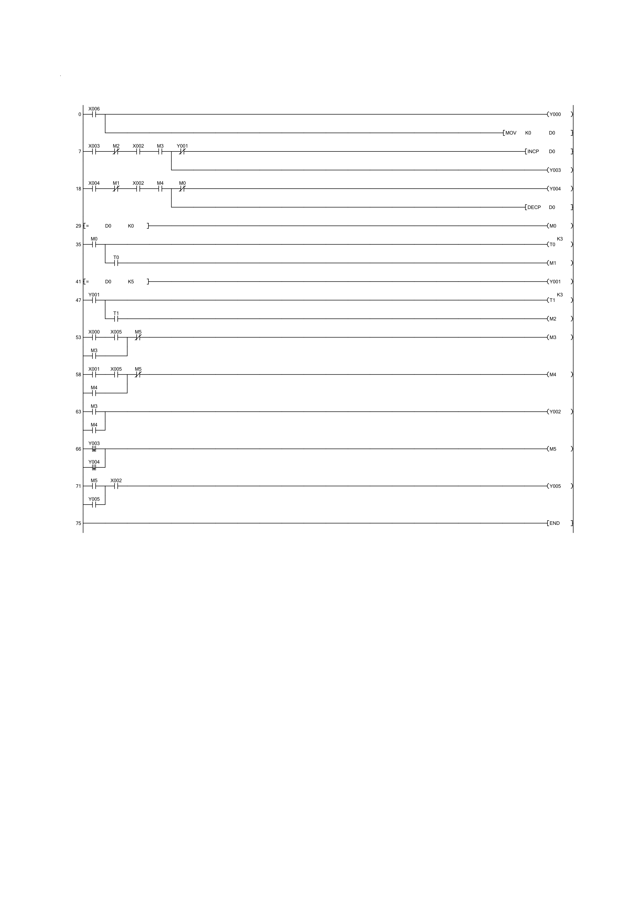
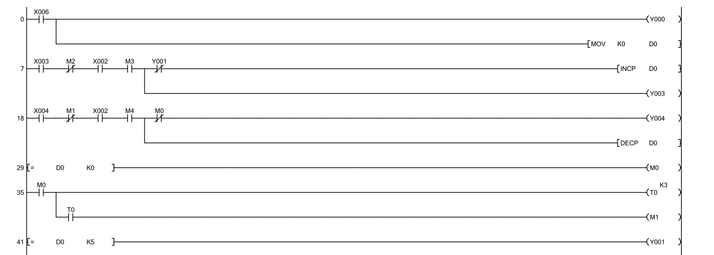
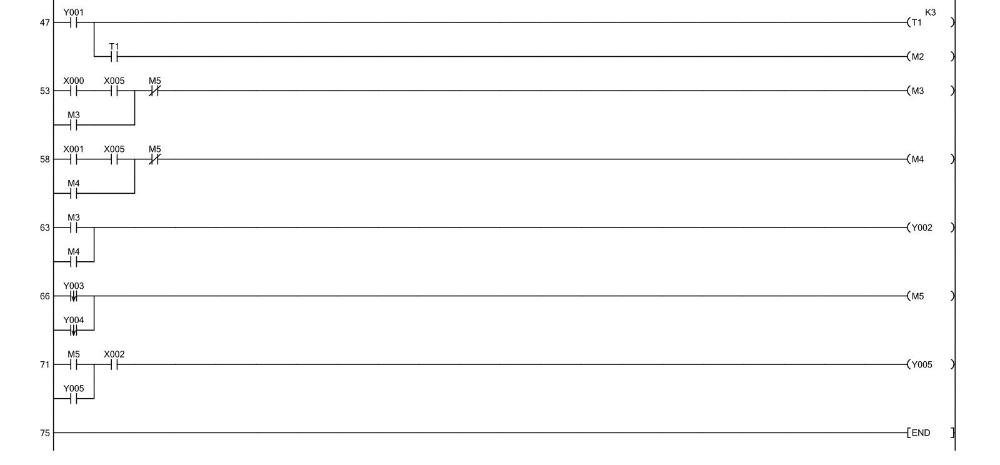

# Parking Automatique avec Barrière — Ladder / API Mitsubishi FX

Projet de TP réalisé dans le cadre du cours **EE452 — Automatisme Industriel**  
IGEE, Université M'Hamed Bougara de Boumerdes (2024/2025).  
Environnement : **GX Works 2**, API **Mitsubishi FX**, Mini-PLC Trainer.

---

## Description

Conception et implémentation d'un programme Ladder pour le contrôle automatique
d'un parking avec barrière motorisée. Le système gère l'entrée et la sortie des
véhicules via compteur bidirectionnel, active une LED FULL à capacité maximale,
et intègre une séquence complète de contrôle de barrière avec protections logiques.

---

## Tableau des Entrées / Sorties

| Référence | Type | Description |
|---|---|---|
| X000 | Entrée | Bouton IN — lever barrière entrée |
| X001 | Entrée | Bouton OUT — lever barrière sortie |
| X002 | Entrée | Fin de course barrière haute |
| X003 | Entrée | Capteur voiture côté IN |
| X004 | Entrée | Capteur voiture côté OUT |
| X005 | Entrée | Fin de course barrière basse |
| X006 | Entrée | Bouton RESET compteur |
| Y000 | Sortie | Reset affichage compteur |
| Y001 | Sortie | LED FULL (rouge) — parking plein |
| Y002 | Sortie | Moteur barrière (LED verte) |
| Y003 | Sortie | Incrément compteur voitures |
| Y004 | Sortie | Décrément compteur voitures |
| Y005 | Sortie | Barrière descend (LED rouge) |

---

## Fonctionnement du système

### Compteur bidirectionnel
Le registre **D0** stocke le nombre de voitures présentes dans le parking.
- **INCP D0** — incrémentation à chaque entrée validée (capteur X003)
- **DECP D0** — décrémentation à chaque sortie validée (capteur X004)

### Protections logiques
Deux protections critiques sont implémentées :
- **Protection limite supérieure** : `[= D0 K5]` active Y001 (LED FULL) et bloque
  toute nouvelle entrée — aucune voiture ne peut entrer quand le parking est plein
- **Protection limite inférieure** : `[= D0 K0]` active M0 qui bloque DECP D0 —
  le compteur ne peut jamais passer en dessous de zéro

### Séquence de barrière (Task 3)
| Étape | Action |
|---|---|
| 1 | Appui bouton IN (X000) ou OUT (X001) → M3 ou M4 activé (auto-maintien) |
| 2 | Y002 s'active → moteur lève la barrière (LED verte) |
| 3 | Barrière pleinement levée → X002 confirme → voiture passe devant capteur |
| 4 | Passage détecté → pulse Y003 (INCP) ou Y004 (DECP) via M5 |
| 5 | M5 coupe M3/M4 → Y005 s'active → barrière redescend |
| 6 | X005 confirme barrière fermée → cycle terminé |

---

## Programme Ladder

### Vue globale

### Compteur bidirectionnel + protections (rungs 0-41)

### Séquence barrière — entrée/sortie (rungs 53-71)

---

## Fichiers

| Fichier | Description |
|---|---|
| [PARKING.gxw](PARKING.gxw) | Fichier projet GX Works 2/3 |
| [docs/car_parking_full.pdf](docs/car_parking_full.pdf) | Export complet GX Works |
| [screenshots/](screenshots/) | Captures du programme GX Works |

---

## Concepts clés démontrés

- Compteur bidirectionnel avec registre de données (INCP/DECP sur D0)
- Protection double contre dépassement de limite haute et basse
- Auto-maintien de relais (M3, M4) pour mémorisation d'état barrière
- Détection de front descendant (M5) via contacts à impulsion Y003/Y004
- Logique conditionnelle multi-critères sur API Mitsubishi FX
