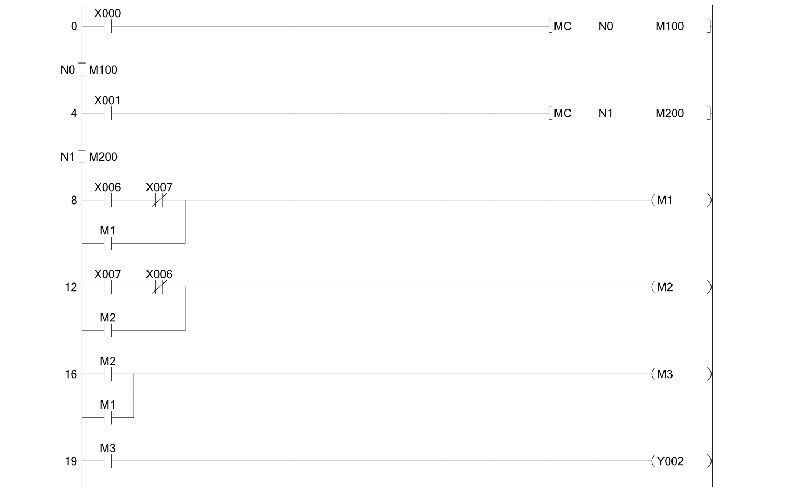
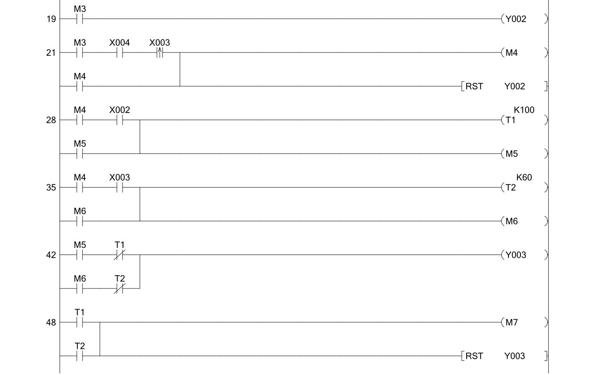
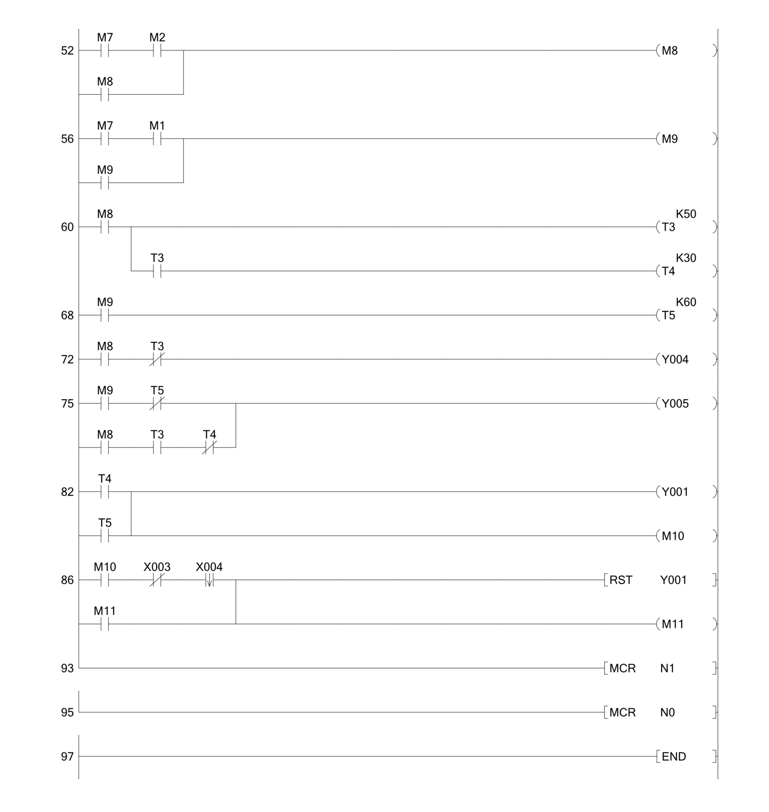

# Machine à Laver — Contrôle Séquentiel Ladder / API Mitsubishi FX

Projet de TP réalisé dans le cadre du cours **EE452 — Automatisme Industriel**  
IGEE, Université M'Hamed Bougara de Boumerdes (2024/2025).  
Environnement : **GX Works 2**, API **Mitsubishi FX**, Mini-PLC Trainer.

---

## Description

Conception et implémentation d'un programme Ladder pour le contrôle séquentiel
d'une machine à laver automatique. Le système gère le remplissage par capteurs
de niveau réels, la sélection de température, le cycle de lavage selon le programme
choisi, et la vidange. L'architecture utilise des **instructions MC/MCR imbriquées**
pour hiérarchiser les conditions de sécurité (marche machine + porte fermée).

---

## Tableau des Entrées / Sorties

| Référence | Type | Description |
|---|---|---|
| X000 | Entrée | Interrupteur ON/OFF machine |
| X001 | Entrée | Capteur porte fermée/ouverte |
| X002 | Entrée | Température 70°C |
| X003 | Entrée | Capteur niveau haut |
| X004 | Entrée | Capteur niveau bas |
| X005 | Entrée | Température 30°C |
| X006 | Entrée | Programme 1 |
| X007 | Entrée | Programme 2 |
| Y001 | Sortie | Pompe vidange |
| Y002 | Sortie | Valve 1 — remplissage |
| Y003 | Sortie | Chauffage |
| Y004 | Sortie | Moteur vitesse lente |
| Y005 | Sortie | Moteur vitesse rapide |

---

## Architecture MC/MCR imbriquée

Le programme utilise **deux niveaux hiérarchiques MC/MCR** :
X000 → MC N0 M100  (Niveau 0 : machine ON/OFF)
│
└── X001 → MC N1 M200  (Niveau 1 : porte fermée)
│
└── [Séquence complète de lavage]
│
MCR N1
│
MCR N0

Cette structure garantit que **toute la séquence s'arrête immédiatement**
si la machine est éteinte (X000) ou si la porte est ouverte (X001),
sans nécessiter de conditions supplémentaires sur chaque rung.

---

## Séquence de fonctionnement (Task 3)

| Étape | Condition | Action |
|---|---|---|
| 1 | X006 ou X007 pressé | M1 ou M2 activé (auto-maintien), M3 démarre remplissage |
| 2 | M3 actif | Y002 ouvre valve — remplissage démarre |
| 3 | X004 détecté | Niveau bas atteint — T2 démarre |
| 4 | X003 détecté | Niveau haut atteint — remplissage terminé, RST Y002 |
| 5 | Utilisateur sélectionne X002/X005 | T1(70°C=10s) ou T2(30°C=6s) → Y003 chauffage |
| 6 | Prog1 → M9 | T5(K60=6s) moteur rapide uniquement → Y005 |
| 7 | Prog2 → M8 | T3(K50=5s) lent Y004, puis T4(K30=3s) rapide Y005 |
| 8 | Cycle lavage terminé | Y001 pompe + valve vidange ouverte |
| 9 | X004 niveau bas détecté | RST Y001 — vidange terminée, cycle complet |

---

## Programme Ladder

### Bloc MC/MCR imbriqué + sélection programme (rungs 0-19)

### Remplissage + capteurs niveau + chauffage (rungs 19-48)

### Cycle lavage + vidange (rungs 52-93)

---

## Fichiers

| Fichier | Description |
|---|---|
| [Machine_a_laver.gxw](Machine_a_laver.gxw) | Fichier projet GX Works 2/3 |
| [docs/Machine_a_laver.pdf](docs/Machine_a_laver.pdf) | Export complet GX Works |
| [screenshots/](screenshots/) | Captures du programme GX Works |

---

## Concepts clés démontrés

- Instructions **MC/MCR imbriquées** (N0 et N1) pour hiérarchie de sécurité
- Simulation de capteurs de niveau réels (bas/haut) pour contrôle de remplissage
- Séquençage conditionnel multi-programme (Prog1 / Prog2)
- Contrôle moteur deux vitesses (lente → rapide) selon programme sélectionné
- Auto-maintien de relais pour mémorisation des sélections utilisateur
- Gestion complète du cycle : remplissage → chauffage → lavage → vidange
