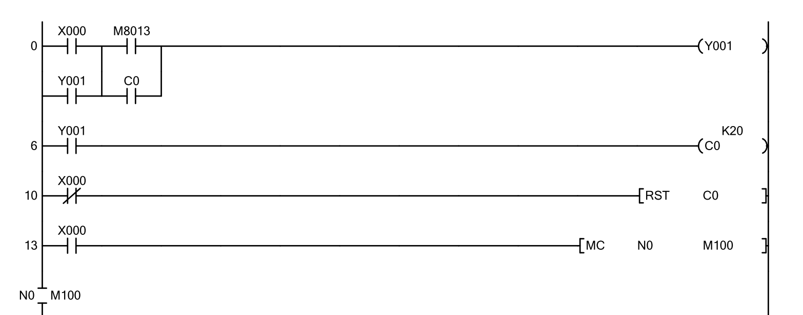

# Alarme Anti-Intrusion — Ladder / API Mitsubishi FX

Projet de TP réalisé dans le cadre du cours **EE452 — Automatisme Industriel**  
IGEE, Université M'Hamed Bougara de Boumerdes (2024/2025).  
Environnement : **GX Works 2**, API **Mitsubishi FX**, Mini-PLC Trainer.

---

## Description

Conception d'un programme Ladder pour le contrôle d'un système d'alarme
anti-intrusion. Le système utilise le relais spécial **M8013** (impulsion
1 seconde) pour générer un clignotement de l'indicateur d'alarme, un
compteur **C0** pour limiter les impulsions, et des instructions
**MC/MCR imbriquées** pour hiérarchiser les phases du système.

---

## Tableau des Entrées / Sorties

| Référence | Type | Description |
|---|---|---|
| X000 | Entrée | Interrupteur SET/RESET alarme |
| X001 | Entrée | Capteur 2 — détection mouvement |
| X002 | Entrée | Capteur 1 — détection intrusion |
| Y000 | Sortie | Lumière de sécurité |
| Y001 | Sortie | Indicateur alarme (LED verte) |
| Y002 | Sortie | Lumière extérieure |
| Y003 | Sortie | Buzzer alarme |

---

## Fonctionnement

- **Phase armement** : X000 active Y001 qui clignote **20 fois** (M8013 + C0)
  pendant que l'occupant quitte les lieux
- **Alarme armée** : après les 20 impulsions, Y001 reste allumé en continu
- **Détection mouvement** (X001) : lumière extérieure Y002 s'allume 5 secondes
- **Détection intrusion** (X002) : buzzer Y003 et lumière Y000 s'activent
  en mode flash jusqu'au reset de X000
- **MC N0** : bloc conditionnel activé après armement complet (C0 atteint)
- **MC N1** : bloc intrusion isolé, activé uniquement sur détection X002

---

## Programme Ladder

### Phase armement + compteur (rungs 0-13)

### Blocs MC/MCR + détection (rungs 13-65)

---

## Fichiers

| Fichier | Description |
|---|---|
| [burglar_alarm.gxw](burglar_alarm.gxw) | Fichier projet GX Works 2/3 |
| [docs/burglar_alarm_full.pdf](docs/burglar_alarm_full.pdf) | Export complet GX Works |
| [screenshots/](screenshots/) | Captures du programme GX Works |

---

## Concepts clés démontrés

- Relais spécial **M8013** (horloge 1 seconde) pour génération d'impulsions
- Compteur **C0** pour limitation du nombre d'impulsions (K20 = 20 cycles)
- Instructions MC/MCR imbriquées pour séquençage conditionnel
- Timers pour temporisation de la lumière de sécurité (T0 = 5 secondes)
